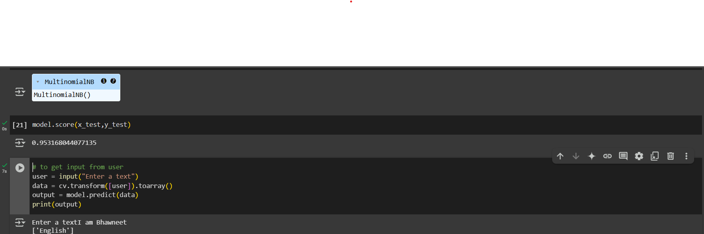

# Language Identifier using NLP

## Description
This project is a language identifier that can detect 22 different languages with an accuracy of 95%. It is built using NLP techniques and various libraries including `sklearn`, `numpy`, and `pandas`. The model is trained on a dataset of 22,000 text samples using the `MultinomialNB` classifier and `train_test_split` for data splitting.

## Screenshot


## Installation

1. Clone the repository:
    ```bash
    git clone https://github.com/Bhawneet1/Language_identifier_using_nlp.git
    ```

2. Navigate to the project directory:
    ```bash
    cd Language_identifier_using_nlp
    ```

3. Install the required dependencies:
    ```bash
    pip install -r requirements.txt
    ```

## Usage

1. Open the Jupyter Notebook:
    ```bash
    jupyter notebook
    ```

2. Run the notebook to train the model and test its accuracy.

3. You can also use the provided script to identify the language of a given text:
    ```bash
    python language_identifier.py "Your text here"
    ```

## Contributing

1. Fork the repository.
2. Create a new branch:
    ```bash
    git checkout -b feature-branch
    ```
3. Make your changes and commit them:
    ```bash
    git commit -m 'Add some feature'
    ```
4. Push to the branch:
    ```bash
    git push origin feature-branch
    ```
5. Open a pull request.

## License
This project is licensed under the MIT License - see the [LICENSE](LICENSE) file for details.

## Contact
For any questions or support, please contact Bhawneet1 at [your-email@example.com](mailto:your-email@example.com).
